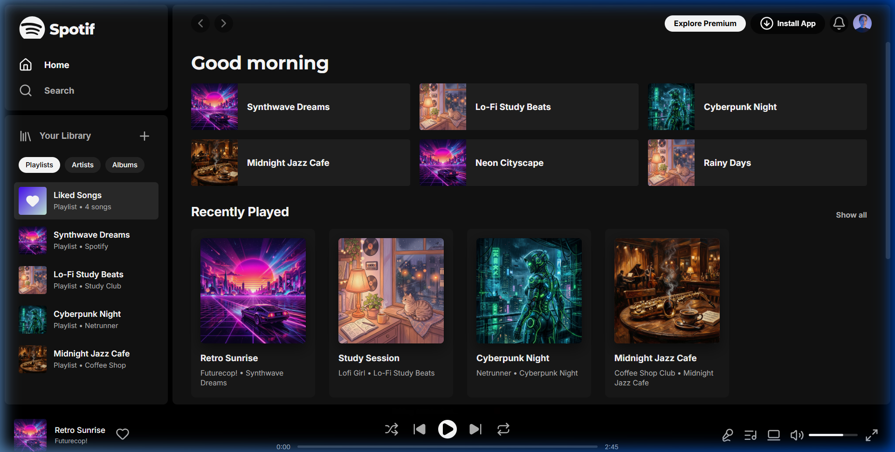
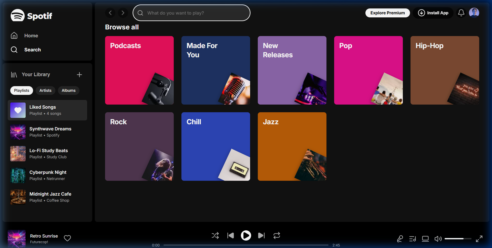
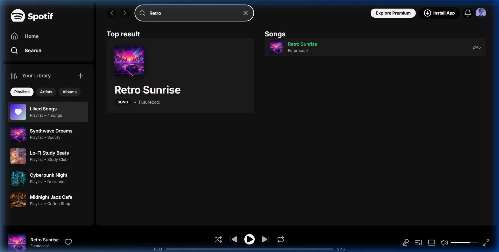

# Spotify Web Player UI Clone

A high-fidelity, interactive user interface clone of the Spotify Web Player built using modern semantic **HTML5**, custom **CSS3 variables (Grid & Flexbox)**, and **Vanilla JavaScript**. 

This application clones Spotify's premium visual appearance and features layout scaling, interactive tab pages, custom sliders, search functionality, and audio playback timeline simulation.

👉 **[Live Demo URL](https://spotify-clone-three-bay.vercel.app/)**

---

## 📸 UI Screenshots

### 🏠 Home Dashboard Page


### 🔍 Search Page (Empty & Active State)
| Empty Search View | Active Search Results |
|:---:|:---:|
|  |  |

---

## 🚀 Key Features

* **Glassmorphic Navigation Header**: A blurred sticky header (`backdrop-filter: blur(16px)`) featuring profile buttons, app install badges, page arrow navigation, and a search input container.
* **Time-based Greetings**: Automatically welcomes the user with *"Good morning"*, *"Good afternoon"*, or *"Good evening"* depending on the user's system hour.
* **Seamless Page Transitions**: Tabs navigation in the sidebar switches views between the **Home** dashboard and the **Search** view.
* **Real-time Fuzzy Search**: The header search input filters tracks, artists, and albums instantly as you type, rendering top results and matching song lists.
* **Interactive Player Footer**: 
  - Visual track info (updates title, artist, album cover, and Liked heart states).
  - Dynamic timeline tracker simulation (ticks progress forward when playing, updates timestamps).
  - Media controls (Play/Pause toggles, skip Next/Previous, Shuffle, and Repeat).
* **Custom Sliders (Seek & Volume)**: Pure CSS range sliders that turn green on hover, display a control thumb, and support mouse click-and-drag scrubbing.
* **Interactive Playlists**: Sidebar playlist categories are clickable and immediately update the player metadata.

---

## 🛠️ Tech Stack

* **Structure**: HTML5 (Semantic Layouts)
* **Styling**: Vanilla CSS3 (Custom Variables, Flexbox, Grid)
* **Logic**: Vanilla ES6+ JavaScript (DOM Manipulation, State, Event Listeners)
* **Vector Icons**: Lucide Icons CDN
* **Typography**: Google Fonts (Inter & Montserrat)

---

## 📂 Project Structure

```
├── assets/                  # Generated album cover arts and screenshots
│   ├── album_chill.png
│   ├── album_cyberpunk.png
│   ├── album_jazz.png
│   ├── album_synthwave.png
│   ├── screenshot_home.png
│   ├── screenshot_search.png
│   └── screenshot_search_active.png
├── index.html               # Main page layout
├── style.css                # Visual stylesheets and animations
├── script.js                # Core interactive player logic
└── README.md                # Project documentation
```

---

## 💻 Quick Start (How to Run)

1. Clone this repository:
   ```bash
   git clone https://github.com/Ashutosh7643/Spotify-Clone.git
   cd Spotify-Clone
   ```

2. Run the application:
   * **Option A**: Simply double-click `index.html` to open it in your web browser.
   * **Option B** (Recommended): Start a local development server for proper module behaviors.
     * **Node.js**:
       ```bash
       npx http-server -p 8000
       ```
     * **Python**:
       ```bash
       python -m http.server 8000
       ```
3. Open `http://localhost:8000` in your web browser.
